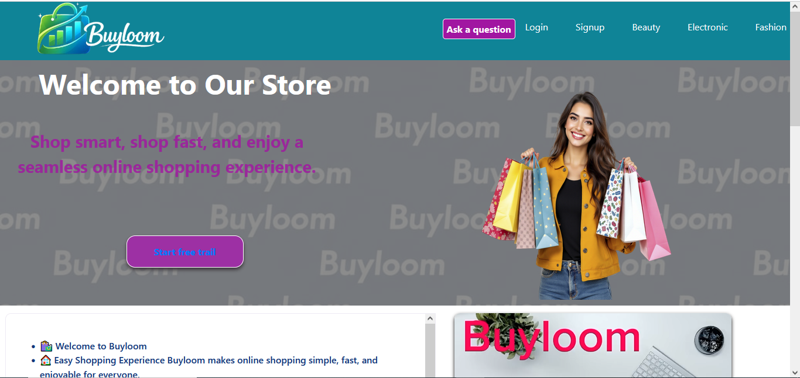
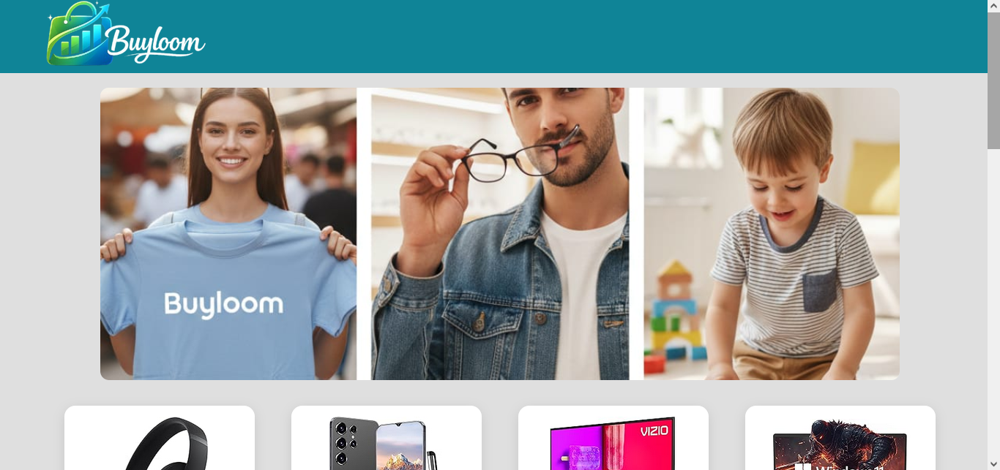
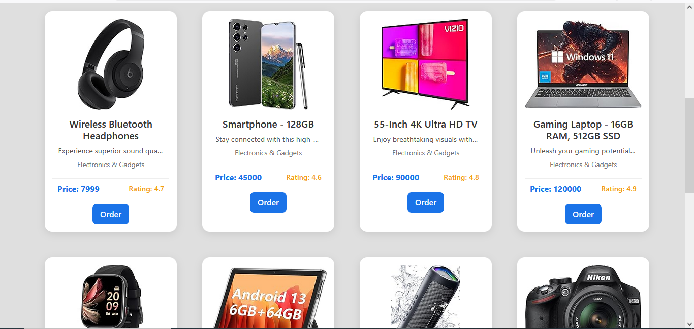
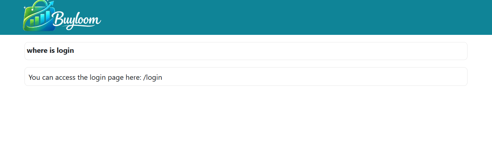
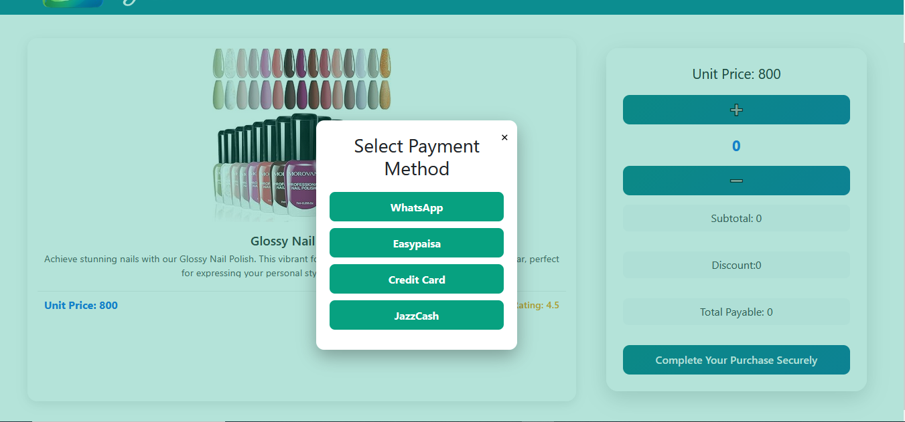

# Buyloom Online Shop 🚀

**Project Purpose:**  
Buyloom is a professional online shopping platform, designed to showcase products, enable orders, and provide instant interaction for users. Optimized for both desktop and mobile devices with responsive layouts, interactive animations, and dynamic product features.

---

## 🔧 Technologies Used

- **Frontend:** React, Bootstrap  
- **Backend:** Node.js, Express  
- **Database:** MongoDB  
- **Other Tools:** JavaScript, Axios, Email Verification , HTML, CSS

---

## 🛍 User Features

- Sign Up with Email Verification  
- Login / Logout  
- Browse Products by Categories & Subcategories  
- Product Details & Order Placement  
- Ask Questions and Receive Instant Answers  
- Contact Admin  
- Animated banners and text effects  

---

## 📸 Screenshots

---

## 🌐 Deployment Links

- **Frontend (Vercel):** [https://buy-loom-online-shop.vercel.app](#)  
- **Backend (Railway/Render):** [https://buyloom-backend-production.up.railway.app](#)  

---

## ⚡ How to Use

1. **Sign Up:** Create a new account and verify email.  
2. **Login:** Access your account using email and password.  
3. **Browse Products:** Navigate categories & subcategories.  
4. **View Product:** Click to see details, variants, pricing, and stock.  
5. **Order Product:** Fill order form and submit.  
6. **Ask Questions:** Use the Q&A section for instant answers.  
7. **Contact Admin:** Reach out for support or inquiries.  

---
 ##  📧 Email Verification System (Resend Integration)
Current Status: Testing/Development Mode 🧪
Why can't everyone sign up?
For security and cost-management, this project uses the Resend email service in Onboarding Mode. This means:
Restricted Domain: Currently, emails can only be sent to the developer's registered email address.
403 Forbidden Error: If you attempt to sign up with a random email, the server will return a 403 status because the domain is not yet verified in a production environment.
How to test the Signup flow?
If you are a recruiter or developer looking to test this feature, please follow these steps:
Contact me to add your email to the Authorized Test Audience.
Or, use the provided Demo Credentials below to explore the app without signing up.
## 💡 Notes

- All products, categories, and subcategories are stored in **MongoDB**.  
- Images, descriptions, prices, and variants are fetched dynamically via **Node.js + Express API**.  
- The website is **fully responsive**, optimized for both desktop and mobile.  
- Animations and text effects enhance professional user experience.  

---
## ---

## 👤 Author & Developer

**Qudratullah** Full Stack Developer 💻

If you have any questions, suggestions, or want to collaborate, feel free to reach out:

- **Email:** [qudratullahmasoom6688@gmail.com] 📧
- **GitHub:** [qudratullah-stack](https://github.com/qudratullah-stack) 🐙
-

## 📌 License

This project is licensed under MIT License.
